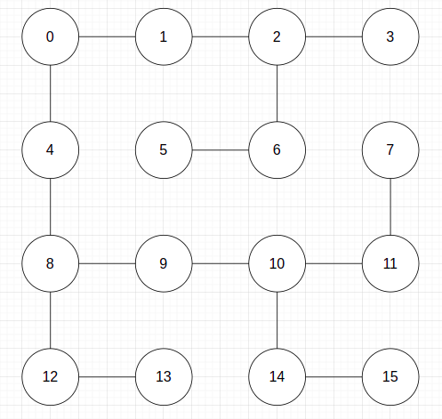

# DFS

## Entrada

```txt
16 15 0
0 4
2 3
6 2
8 9
10 9
8 12
14 15
14 10
6 5
10 11
11 7
4 8
0 1
1 2
12 13
```

## Grafo



## Saída

```txt
Number of vertex: 16
Adjacency list:
ID: 0
  Color: 2
  Father: NULL
  Edges: 4 1

ID: 1
  Color: 2
  Father: 0
  Edges: 0 2

ID: 2
  Color: 2
  Father: 1
  Edges: 3 6 1

ID: 3
  Color: 2
  Father: 2
  Edges: 2

ID: 4
  Color: 2
  Father: 0
  Edges: 0 8

ID: 5
  Color: 2
  Father: 6
  Edges: 6

ID: 6
  Color: 2
  Father: 2
  Edges: 2 5

ID: 7
  Color: 2
  Father: 11
  Edges: 11

ID: 8
  Color: 2
  Father: 4
  Edges: 9 12 4

ID: 9
  Color: 2
  Father: 8
  Edges: 8 10

ID: 10
  Color: 2
  Father: 9
  Edges: 9 14 11

ID: 11
  Color: 2
  Father: 10
  Edges: 10 7

ID: 12
  Color: 2
  Father: 8
  Edges: 8 13

ID: 13
  Color: 2
  Father: 12
  Edges: 12

ID: 14
  Color: 2
  Father: 10
  Edges: 15 10

ID: 15
  Color: 2
  Father: 14
  Edges: 14
```
